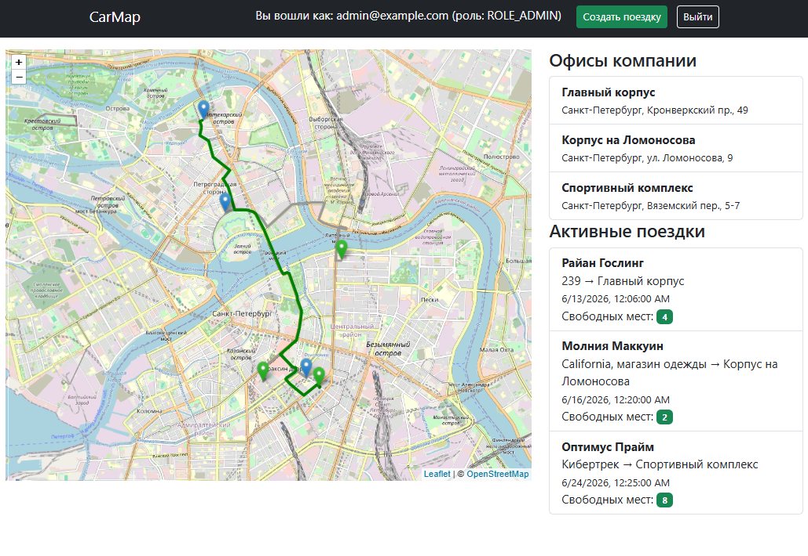
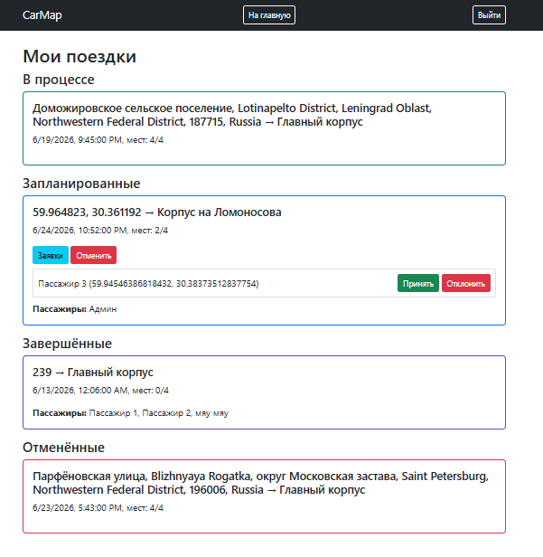
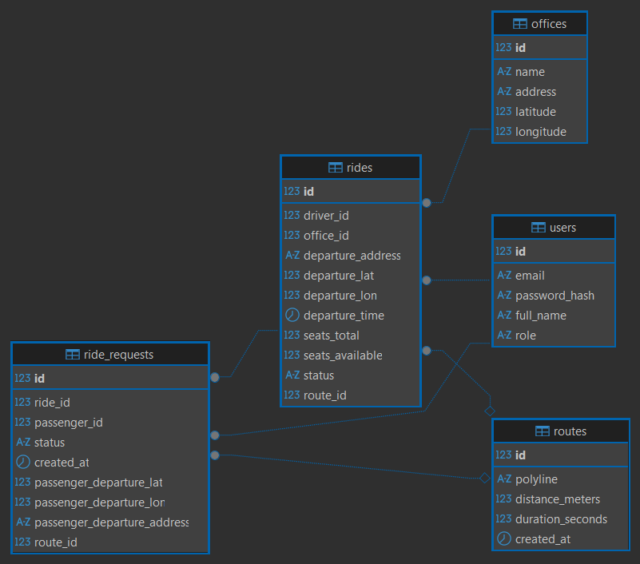

# Приложение для совместных поездок в офис 

**Задача:** помочь сотрудникам одной компании вместе ездить в офис.

**Функциональность:**
1. Отображение карты, на которой указаны офисы компании.
2. Водители могут выбирать офис, в который поедут, место, из которого поедут, и время.
3. Отображение маршрута поездки и его примерное время.
4. Обычные пользователи могут посмотреть, кто именно едет в необходимый офис, и присоединиться к поездке.
5. Ограничения, кто может присоединиться, а кто нет.

## Интерфейс





## Схема данных



## Инструкция по запуску
1. Склонировать репозиторий:

```
git clone
```
2. Запустить приложение:

```
docker compose up
```

3. Открыть в браузере http://localhost:8080

Для запуска должны быть установлены переменные среды `JWT_SECRET`, `POSTGRES_DB`, `POSTGRES_USER`, `POSTGRES_PASSWORD`. 

JWT-секрет можно сгенерировать, например, командой `openssl rand -base64 64`

## Технологии

- Язык программирования: Java 21
- Фреймворк: Spring Boot 4.0.6 (Web, Security, Data JPA, WebSocket)
- Сборка: Gradle (Kotlin DSL)
- Фронтенд: Thymeleaf, Bootstrap
- Аутентификация: JJWT
- Картография: 
    - Leaflet (библиотека для отображени карты), 
    - OpenStreetMap (источник географических данных), 
    - OSRM (сервис маршрутизации), 
    - Nominatim (сервис геокодирования)
- Миграции: Liquibase
- База данных: PostgreSQL 15
- Контейнеризация: Docker, Docker Compose
