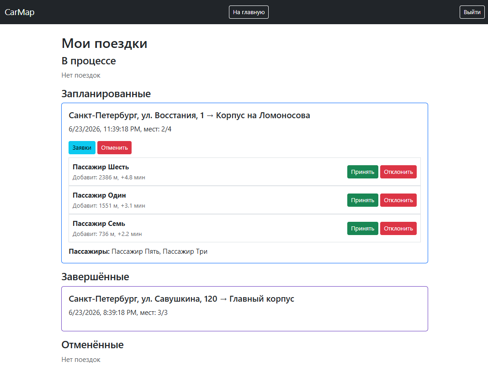
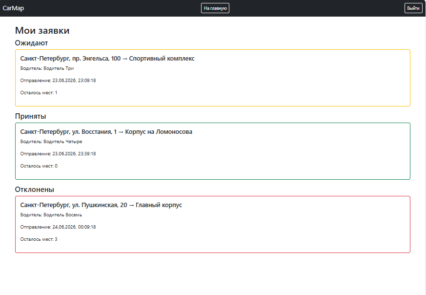
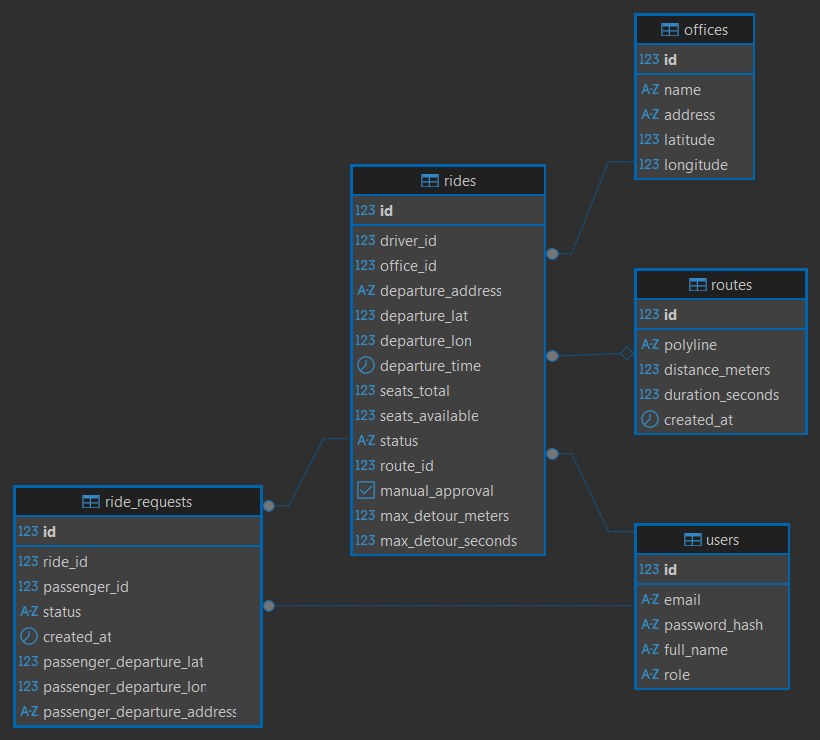

# Приложение для совместных поездок в офис 

Приложение для совместных поездок в офис сотрудниками одной компании.

## Основные возможности
- **Интерактивная карта** – офисы компании, маршруты поездок и точки посадки пассажиров на Leaflet + OpenStreetMap.
- **Создание поездки** – водитель указывает офис, время и место отправления (выбором точки на карте), автоматический расчёт маршрута через OSRM.
- **Присоединение к поездке** – пассажиры подают заявки, выбирая свою точку посадки на карте.
- **Пересчёт маршрута** – маршрут перестраивается динамически с учётом промежуточных точек посадки пассажиров. Результаты запросов к OSRM кэшируются (Caffeine на 60 секунд).
- **Ручное или автоматическое отклонение** – водитель может включить ручное подтверждение заявок либо задать лимиты добавочного расстояния/времени, при превышении которых заявка автоматически отклоняется.
- **Уведомления в реальном времени** – WebSocket-уведомления (STOMP) для водителя о новых заявках, для пассажира – об изменении статуса заявки. 
- **Личные кабинеты** – «Мои поездки» (водитель) и «Мои заявки» (пассажир) с группировкой по статусам, счетчиком непрочитанных заявок и возможностью подтвердить/отклонить заявки.
- **Административная панель** – управление списком офисов (добавление, редактирование, удаление) с выбором координат на карте.
- **Ролевая модель** – три роли: пассажир (USER), водитель (DRIVER), администратор (ADMIN). Аутентификация через JWT.

## Интерфейс






## Схема данных

- User – пользователь системы (Админ, Водитель, Пассажир) 
- Ride – поездка
- Route – маршрут поездки 
- RideRequest – запрос на присоединение к поездке 
- Office – офис

## Инструкция по запуску
1. Склонируйте репозиторий:

```
git clone https://github.com/kaleidostop/car-map
```
2. Запустите базу данных:

```
docker compose up -d
```

3. Создайте файл .env в корне проекта с переменной `JWT_SECRET` (или задайте переменную окружения).

JWT-секрет можно сгенерировать, например, командой `openssl rand -base64 64`

4. Запустите приложение
```
./gradlew bootRun
```
При первом запуске дождитесь, когда сгенерируются тестовые данные. 

5. Откройте http://localhost:8080

## Технологии

- Язык программирования: Java 21
- Фреймворк: Spring Boot 4.0.6 (Web, Security, Data JPA, WebSocket)
- Сборка: Gradle (Kotlin DSL)
- Фронтенд: Thymeleaf, Bootstrap
- Аутентификация: JJWT
- Картография: 
    - Leaflet (библиотека для отображени карты), 
    - OpenStreetMap (источник географических данных), 
    - OSRM (сервис маршрутизации), 
    - Nominatim (сервис геокодирования)
- Миграции: Liquibase
- База данных: PostgreSQL 15
- Контейнеризация: Docker, Docker Compose
